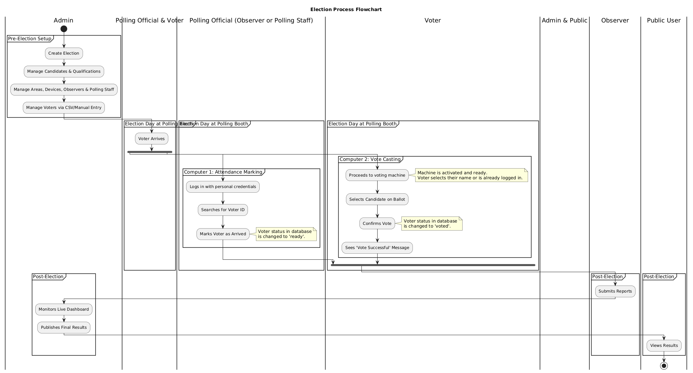
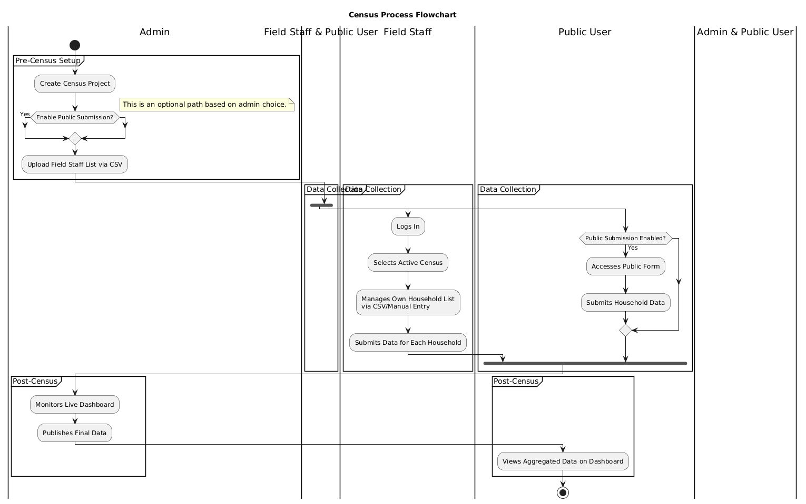

# PS3Stack Voting System

A comprehensive microservices-based electronic voting system built with Ballerina and Next.js, featuring real-time monitoring, census management, and AI-powered support.

## 🏗️ Architecture Overview

This system follows a microservices architecture with the following components:

- **API Gateway** - Central routing and authentication hub
- **Auth Service** - User authentication and authorization
- **Election Service** - Election and candidate management
- **Voter Service** - Voting operations and voter check-in
- **Support Service** - AI-powered chatbot support
- **Census Service** - Population census management
- **Client Application** - Next.js frontend with real-time UI

## 📊 System Architecture Diagram for election



## 📊 System Architecture Diagram for census



## 🚀 Quick Start

### Prerequisites

- **Ballerina** (Swan Lake Update 8 or later)
- **Node.js** (18+ recommended)
- **npm** or **yarn**
- **Docker** (optional, for containerized deployment)

### 1. Clone the Repository

```bash
git clone https://github.com/PS3stack/ps3stack-ballerina-competition.git
cd ps3stack-ballerina-competition
```

### 2. Start Backend Services

```bash
# Start all microservices (run each in a separate terminal)

# API Gateway
cd api_gateway
bal run

# Auth Service
cd ../services/auth_service
bal run

# Election Service
cd ../election_service
bal run

# Voter Service  
cd ../voter_service
bal run

# Support Service
cd ../support_service
bal run

# Census Service
cd ../census_service
bal run
```

### 3. Start Frontend

```bash
cd client
npm install
npm run dev
```

### 4. Access the Application

- **Frontend**: http://localhost:3000
- **API Gateway**: http://localhost:8080
- **Individual Services**: See service-specific README files

## 🔑 API Keys Configuration

### Required API Keys

The Support Service requires an **OpenAI API key** for AI-powered chatbot functionality:

1. **Obtain OpenAI API Key**:
   - Visit [OpenAI Platform](https://platform.openai.com/api-keys)
   - Create an account or sign in
   - Navigate to "API Keys" section
   - Click "Create new secret key"
   - Copy the generated key (starts with `sk-`)

2. **Configure the Key**:
   - Navigate to `services/support_service/`
   - Copy `Config.toml.example` to `Config.toml`
   - Replace the placeholder with your actual API key:
   ```toml
   HTTP_PORT = 8083
   OPENAI_API_KEY = "your-actual-openai-api-key-here"
   ```

### Environment Files

Each service includes `.toml.example` files with placeholder values. Copy these to the actual config files and replace placeholders with real values:

- `api_gateway/Config.toml.example` → `Config.toml`
- `services/*/Config.toml.example` → `Config.toml`
- `client/.env.example` → `.env.local`

**Important**: Never commit actual API keys to version control. The `.example` files are safe to commit as they contain only placeholders.

## 🏛️ System Components

| Component | Port | Description |
|-----------|------|-------------|
| [API Gateway](./api_gateway/README.md) | 8080 | Central routing, authentication, CORS handling |
| [Auth Service](./services/auth_service/README.md) | 8085 | JWT authentication, role-based access |
| [Election Service](./services/election_service/README.md) | 8082 | Election management, candidates, observers |
| [Voter Service](./services/voter_service/README.md) | 8084 | Voting operations, voter check-in |
| [Support Service](./services/support_service/README.md) | 8083 | AI chatbot, help system |
| [Census Service](./services/census_service/README.md) | 8081 | Population census, household management |
| [Client App](./client/README.md) | 3000 | Next.js frontend application |

## 👥 User Roles & Access

### Admin (Role ID: 1)
- Full system access
- Election management
- User management
- System monitoring
- **Demo Login**: admin@test.com / password123

### Observer (Role ID: 2)
- Election monitoring
- Results viewing
- Report generation

### Field Staff (Role ID: 3)
- Census data collection
- Household surveys
- Area assignments

### Polling Staff (Role ID: 4)
- Voting operations
- Voter check-in
- Ballot management

## 🛡️ Security Features

- **JWT Authentication** with secure token validation
- **Role-based Access Control** (RBAC)
- **CORS Protection** for cross-origin requests
- **Input Validation** and sanitization
- **Secure Cookie** handling
- **API Rate Limiting** (configurable)

## 🔄 API Endpoints

### Core Endpoints

```
POST /api/auth/admin/login          # Admin authentication
POST /api/auth/observer/login       # Observer authentication
POST /api/auth/field_staff/login    # Field staff authentication
POST /api/auth/polling_staff/login  # Polling staff authentication

GET  /api/election                  # List elections
POST /api/election                  # Create election
GET  /api/election/{id}            # Get election details

POST /api/voters/cast              # Cast vote
POST /api/voters/check-in          # Voter check-in

POST /api/support/chat             # AI chatbot
GET  /api/support/health           # Service health

GET  /api/census                   # Census projects
POST /api/census                   # Create census project
```

See individual service README files for complete API documentation.

## 🧪 Testing

### Demo Accounts

| Role | Email | Password | Access Level |
|------|-------|----------|--------------|
| Admin | admin@test.com | password123 | Full system access |
| Observer | observer@test.com | password123 | Read-only monitoring |
| Field Staff | field@test.com | password123 | Census operations |
| Polling Staff | polling@test.com | password123 | Voting operations |

### Health Checks

```bash
# Check all services
curl http://localhost:8080/health

# Individual service health
curl http://localhost:8085/auth/health
curl http://localhost:8082/election/health
curl http://localhost:8084/voters/health
curl http://localhost:8083/support/health
curl http://localhost:8081/census/health
```

## 📝 Development

### Project Structure

```
ps3stack-ballerina-competition/
├── api_gateway/                 # API Gateway service
├── services/                    # Microservices
│   ├── auth_service/           # Authentication service
│   ├── election_service/       # Election management
│   ├── voter_service/          # Voting operations
│   ├── support_service/        # AI support system
│   └── census_service/         # Census management
├── client/                     # Next.js frontend
└── docs/                       # Documentation
```

### Development Workflow

1. **Backend Development**: Modify Ballerina services in `services/` or `api_gateway/`
2. **Frontend Development**: Work in `client/` directory
3. **Testing**: Use the demo accounts for end-to-end testing
4. **API Testing**: Use tools like Postman or curl for API testing

### Configuration Management

All services use `Config.toml` files for configuration:
- Copy `.toml.example` files to `Config.toml`
- Set appropriate values for your environment
- Never commit actual API keys or sensitive data

## 🚢 Deployment

### Docker Deployment (Recommended)

```bash
# Build and run with Docker Compose
docker-compose up --build
```

### Manual Deployment

1. Build each Ballerina service:
```bash
cd services/auth_service && bal build
cd ../election_service && bal build
# ... repeat for each service
```

2. Build frontend:
```bash
cd client && npm run build
```

3. Deploy to your hosting platform of choice

## 🤝 Contributing

1. Fork the repository
2. Create a feature branch (`git checkout -b feature/amazing-feature`)
3. Commit your changes (`git commit -m 'Add amazing feature'`)
4. Push to the branch (`git push origin feature/amazing-feature`)
5. Open a Pull Request

## 📄 License

This project is licensed under the MIT License - see the [LICENSE](LICENSE) file for details.

## 🆘 Support

- **AI Support**: Use the built-in chatbot (accessible after login)
- **Issues**: Create a GitHub issue for bugs or feature requests
- **Documentation**: Check individual service README files
- **Community**: Join our development community

## 🏆 Acknowledgments

- Built for the Ballerina Programming Competition
- Powered by Ballerina Swan Lake
- Frontend built with Next.js and Tailwind CSS
- AI features powered by OpenAI

---

**PS3Stack Team** - Building the future of democratic technology
